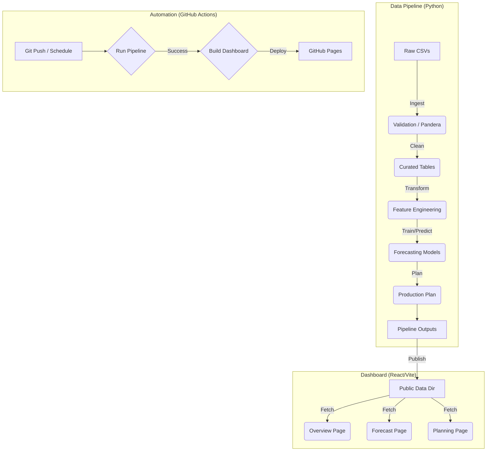

# Architecture

## Flow
1. **Ingestion**: Raw sales and inventory CSVs are read. Invalid rows (negative values, unknown SKUs) are flagged.
2. **Transformation**: Data is aggregated to daily level. Features (lags, rolling means) are computed.
3. **Forecasting**:
   - **Baseline**: Moving Average (SMA7).
   - **ML**: GradientBoostingRegressor trained per SKU.
   - Best model is selected based on MAPE using walk-forward validation.
4. **Planning**:
   - Safety stock calculated dynamically.
   - Production needed = Target Stock - Current Stock.
   - Values rounded to MOQ.
5. **Dashboard**: Static React site fetches the generated CSV/JSON files to visualize results.
